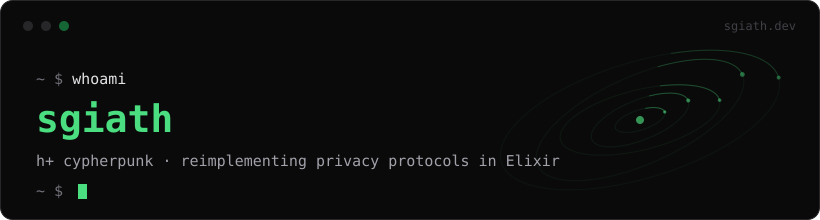

My niche is reimplementing privacy-oriented projects and specifications in Elixir
and never finishing them. I like knowing what the important pieces are doing
underneath the friendly API.

More about me (and things I actually finished) at
**[sgiath.dev](https://sgiath.dev)** · [blog](https://sgiath.dev/blog) ·
[projects](https://sgiath.dev/projects) · [libraries](https://sgiath.dev/libraries) ·
[resume](https://sgiath.dev/resume)

## unfinished so far

| project | status |
| --- | --- |
| [secp256k1](https://github.com/sgiath/secp256k1) — Elixir wrapper for Bitcoin Core secp256k1 | native bindings, works |
| [noise-protocol](https://github.com/sgiath/noise-protocol) — Noise Protocol Framework in pure Elixir | handshakes and all |
| [nostr](https://github.com/sgiath/nostr) — collection of Nostr libraries ([lib](https://github.com/sgiath/nostr-lib) · [client](https://github.com/sgiath/nostr-client) · [relay](https://github.com/sgiath/nostr-private-server)) | usable, eternally WIP |
| [reticulum](https://github.com/sgiath/reticulum) — Reticulum network stack in Elixir | in progress |
| [spaceboy](https://github.com/sgiath/spaceboy) — server framework for the Gemini protocol | small web, small framework |

## not even started yet

- full Bitcoin network stack in Elixir
- full Lightning network in Elixir

## contacts

| | |
| --- | --- |
| web | [sgiath.dev](https://sgiath.dev) |
| email | [sgiath@sgiath.dev](mailto:sgiath@sgiath.dev) |
| Nostr | `npub1qqqqq2z444usdf6k306djuwcyptfjj4x0teu7qzg4qj5zkkfqeeq3hlwh5` |
| | hex: `0000002855ad7906a7568bf4d971d82056994aa67af3cf0048a825415ac90672` |
| Matrix | `@sgiath:sgiath.dev` |
| IRC (libera) | `sgiath` |
| XMPP | `sgiath@sgiath.dev` |

PGP: [`B166 3624 D093 688E D5C3  296B 70F9 C7DE 34CB 3BC8`](https://sgiath.dev/sgiath.asc)
